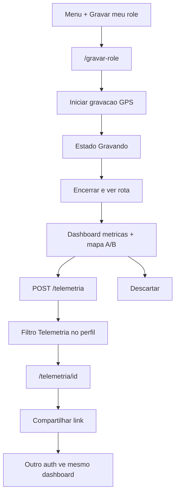

# SPEC 030 — Tela de Telemetria (Gravar meu rolê)

> **Status:** Proposta  
> **Autor:** Assistente IA  
> **Data:** 2026-09-20  
> **Referência visual:** `designs/telemetria/` (`DESIGN.md`, `code.html`, `screen.png`)  
> **Padrões:** Next.js 15 App Router — Server Components por padrão, Client só com interatividade / GPS / permissão (skill `nextjs-patterns`)  
> **Backend:** Cloud Function `api` (Express) — router `/telemetria`  
> **Coleção Firestore:** `rolestelemetria` (**nova**)  
> **Depende de:** SPEC 001 (shell + dock `+`), SPEC 012 (PWA — continua; gravação background só no Capacitor), SPEC 019 (deep link Maps), SPEC 025 (perfil público + histórico), SPEC 028 (garagem — limpeza de selos GPS)  
> **Substitui o fluxo de produto da:** SPEC 029 (telemetria ligada ao comboio) — ver §2.4  
> **Estende:** perfil próprio e público com filtro **Telemetria**; menu Incluir para todos os autenticados

---

## 1. Objetivo

Permitir que **qualquer piloto autenticado** grave a telemetria de um **passeio próprio** (não necessariamente um rolê de comboio da coleção `roles`), a partir do menu **`+`**, e ao finalizar veja um **dashboard** com:

| Métrica | Unidade |
|---------|---------|
| Distância | km |
| Tempo total | duração |
| Velocidade máxima | km/h |
| Velocidade média | km/h |

Mais **mapa resumido** (ponto de partida e ponto de chegada) e CTAs **Salvar** / **Descartar**.

Após salvar, o registro vive em `rolestelemetria`, aparece no **perfil** (filtro Telemetria) e pode ser **compartilhado**: outro piloto autenticado abre a mesma tela de dashboard em somente leitura.



Esta spec é **full stack**:

| Camada | Responsabilidade |
|--------|------------------|
| Front (Next.js) | Menu `+`, cockpit `/gravar-role`, dashboard `/telemetria/[id]`, filtro no perfil, share, remoção da UI GPS da 029 |
| Capacitor (já no repo) | GPS em background; sessão **sem** `roleId` de comboio |
| Back (Functions) | CRUD mínimo de `rolestelemetria`; listagem por uid; leitura autenticada por id |
| PWA / browser | **Não** grava com tela off — copy explica app nativo |

`usuarioId` **nunca** vem do body. Timestamps de sessão vêm do **device** (ISO); servidor grava `createdAt` / `updatedAt`. Não misturar com `roles`, `usersrole`, `userstelemetria` (legado 029) nem feedback (SPEC 010 / 027).

---

## 2. Recorte e princípios

### 2.1 O que entra

- Item **Gravar meu rolê** no menu do `+` para **todos** os autenticados (comum e admin).
- Rota **`/gravar-role`**: idle → gravando → resumo pré-save (mesmo visual do dashboard).
- Rota **`/telemetria/[id]`**: dashboard persistido (dono: Salvar já feito + Compartilhar; visitante: só leitura).
- Coleção **`rolestelemetria`** com id auto (um doc por gravação salva; várias por piloto).
- Endpoints `POST /telemetria`, `GET /telemetria`, `GET /telemetria/:id`.
- Integração no histórico do perfil: filtro tipo **Telemetria** (próprio e público).
- Compartilhar via Web Share API / copiar URL absoluta de `/telemetria/[id]` (visitante **autenticado**).
- Reaproveitar e **generalizar** `src/lib/telemetria/` (adapter GPS + cálculo de métricas); desacoplar de `roleId` de comboio.
- **Remover** UI/endpoints/produto da SPEC 029 ligados ao comboio (ver §2.4).
- Remover selos/avisos GPS em Meus Rolês e no detalhe/participar do rolê.

### 2.2 O que **não** entra (MVP)

| Item | Motivo |
|------|--------|
| Polyline completa / trilha neon / apex / altimetria do mock | Fase 2; MVP só pontos A e B |
| Badge **Ritmo Moderado** no resumo | Sem regra de produto estável; omitir |
| Fotos durante o rolê / publicar no feed comunitário | Fora |
| Landing anônima tipo SPEC 015 (`/t/{id}` sem login) | Só autenticados veem dashboard |
| Vincular telemetria a um `roles` existente | Produto é passeio solo; comboio continua separado |
| PATCH / DELETE de telemetria salva | MVP só criar + ler; descartar = só local pré-POST |
| Velocidade via OBD / ECU | Só GPS do celular |
| Ranking / comparação entre pilotos | Fora |
| Alterar Security Rules do client | Continua deny-all; escrita só via Functions |
| Remover strip `TelemetriaGaragem` (contadores da garagem) | Não é GPS; SPEC 028 |

### 2.3 Princípios

1. **Passeio próprio ≠ comboio.** `rolestelemetria` não referencia `roles.id`.
2. **Nativo segura o GPS; web só orquestra.** Com tela off o JS pode morrer — a sessão vive no plugin Capacitor.
3. **Resumo no device, persistência na API.** POST envia métricas + pontos A/B (+ título); não manda milhares de pontos no MVP.
4. **Uma sessão ativa por aparelho.** Iniciar outra gravação com sessão aberta → bloquear ou pedir Finalizar.
5. **Honestidade de UX.** PWA não finge background; copy de permissão Sempre / segundo plano.
6. **Dashboard único.** Pós-gravação e visualização (própria ou alheia) compartilham os mesmos componentes de métricas + mapa A/B.

### 2.4 Relação com SPEC 029 (substituição)

A SPEC 029 entregou telemetria **amarrada ao comboio** (`userstelemetria`, `POST|GET /roles/:id/telemetria`, painel em `/roles/[id]/participar`, selo em Meus Rolês). Esta SPEC **substitui esse fluxo de produto**:

| Artefato 029 | Ação na implementação da 030 |
|--------------|------------------------------|
| UI `PainelTelemetriaRole` / botões no participar | Remover |
| `SeloGravandoTelemetria` nos cards da garagem | Remover |
| `AvisoSessaoTelemetria` no layout `(app)` (se só servia comboio) | Remover ou reancorar em `/gravar-role` |
| Rotas `POST\|GET /roles/:id/telemetria` | Remover do router |
| Coleção `userstelemetria` | Parar de escrever; docs existentes podem permanecer órfãos (sem migration obrigatória no MVP) |
| Adapter `start(roleId)` | Generalizar para sessão standalone (`sessaoId` local / sem role de comboio) |
| Stack Capacitor + `@capgo/background-geolocation` | **Manter** e reusar |

**Não** manter dois produtos de gravação lado a lado.

### 2.5 Relação com outras specs

| Spec | Papel |
|------|--------|
| **001** | Dock `+`; esta spec muda o comportamento do botão Incluir para **sempre** abrir menu (também o usuário comum) |
| **012** | PWA continua; background GPS continua exigindo app nativo |
| **015** | Padrão de Web Share / copy link — **sem** página pública anônima nesta spec |
| **019** | Deep link “Abrir no Google Maps” a partir de A/B |
| **025** | Perfil público ganha filtro Telemetria na listagem de histórico |
| **028** | Garagem: remove selos GPS; **mantém** `TelemetriaGaragem` (contadores) |
| **029** | Substituída no produto (§2.4) |

---

## 3. Referência de Design

Replicar o visual de `designs/telemetria/` (`code.html` + `screen.png`). Tokens em `DESIGN.md` / `globals.css`. **Não** copiar HTML do Stitch (Tailwind CDN) — CSS Modules + Barlow Condensed / Plus Jakarta Sans.

### 3.1 O que entra do mock

- Bloco de status: ícone GPS + label **Gravando em segundo plano** (ou idle / GPS pronto) + cronômetro `telemetry-num`.
- CTA primário laranja altura `touch-target` (56px): **Iniciar gravação** / **Encerrar e ver rota**.
- Card de resumo: badge **Telemetria gravada**, título do passeio, subtítulo com horário de conclusão.
- Faixa do mapa: label **Traçado GPS · {km}**, link **Google Maps**.
- Marcadores **Partida (A)** e **Destino (B)** com nome/endereço resumido.
- Grid **2×2**: Distância · Tempo total · Vel. máx · Vel. média (`telemetry-num` + `badge-label`).
- CTA **Salvar rolê** + secundário **Descartar / Novo rolê** (pré-persistência).
- Superfície `#121316`, `primary-container` `#ff6b00`, tertiary ciano para ponto A / instrumentação.

### 3.2 Desvios conscientes do mock

| Mock | Nesta spec | Por quê |
|------|------------|---------|
| Header **Criar Role** + logo | Título **Gravar rolê** (gravação) / **Telemetria** (dashboard salvo); Voltar | Não confundir com `/criar-role` (comboio) |
| Polyline neon + malha SP-160/148 + apex + altimetria | Só A/B + preview estático ou SVG mínimo A→B | Sem storage de trilha no MVP |
| Badge **Ritmo Moderado** | **Omitir** | Sem regra de ritmo automática no MVP |
| **Sessão #24** sequencial | Omitir número de sessão; subtítulo com data/hora | Sem contador global obrigatório |
| Nome de rodovia inventado no mapa | Reverse geocode Nominatim (já no app) para labels A/B; fallback lat/lng curtos | Dados reais |
| Fotos do rolê / “Publicar na comunidade” | Fora | Escopo |
| Menu inferior no HTML isolado | Dock SPEC 001; em `/gravar-role` durante gravação pode ocultar dock ou manter — preferir **manter dock** com cuidado de não iniciar outro fluxo | Consistência |
| Fonte / Tailwind CDN | Tokens + CSS Modules | Padrão do app |

### 3.3 Copy sugerida

| Momento | Texto |
|---------|--------|
| Item menu `+` | **Gravar meu rolê** / subtítulo “Telemetria GPS do seu passeio” |
| Idle | **Iniciar gravação** |
| Gravando | Badge **Gravando em segundo plano** · CTA **Encerrar e ver rota** |
| Sem Capacitor | Telemetria com tela desligada só no app Rolemoto (Android/iOS). |
| Permissão negada | Precisamos da localização **sempre** para medir o passeio com a tela off. |
| Salvar | **Salvar rolê** |
| Descartar | **Descartar** |
| Share | **Compartilhar** |
| Título default | `Rolê · {dd}/{mm} {HH}:{mm}` (pt-BR) |

---

## 4. Fluxo do usuário

### 4.1 Feliz (Capacitor)

```
Piloto toca + → Gravar meu rolê
  → /gravar-role (idle)
  → Iniciar gravação
  → SO: permissão When in use → Always / background
  → plugin tracking + notificação (Android)
  → UI: GRAVANDO + cronômetro (pode apagar tela)
  → Encerrar e ver rota
  → plugin para; app lê agregados + primeiro/último ponto
  → reverse geocode opcional para labels A/B
  → resumo (métricas + mapa A/B + título editável)
  → Salvar → POST /telemetria → redirect /telemetria/{id}
  → Compartilhar (opcional)
```

### 4.2 Descartar

```
Resumo pré-save
  → Descartar
  → limpa resumo local / sessão
  → volta idle em /gravar-role (ou /)
  → nada no Firestore
```

### 4.3 Cold start com sessão ativa

```
App morto, tracking nativo ainda rodando
  → abre app (qualquer rota)
  → bootstrap: getSession()?
  → se ativa → deep link / banner para /gravar-role em estado Gravando
```

### 4.4 Perfil e share

```
Perfil próprio ou /perfil/[uid]
  → filtro tipo Telemetria
  → lista cards (título, data, km, tempo)
  → toque → /telemetria/{id}
  → dono: Compartilhar
  → outro autenticado: mesmo dashboard, sem Salvar/Descartar
```

### 4.5 Web / PWA

```
Mesmo item no +
  → /gravar-role
  → se !Capacitor.isNativePlatform()
  → CTA Iniciar disabled + copy §3.3
  → sem watchPosition “de mentira”
```

### 4.6 Erros

| Situação | Comportamento |
|----------|----------------|
| Permissão só “enquanto usa” | Não inicia background; explicar Sempre |
| GPS sem fix | Sessão continua; km podem ficar baixos — ok |
| POST falha (offline) | Manter resumo local + **Tentar salvar de novo** |
| GET telemetria inexistente | 404 → empty state |
| Visitante sem login em `/telemetria/:id` | GuardaApp → login com `?next=` |
| Sessão já ativa e toca Iniciar de novo | Bloquear com mensagem |

---

## 5. Arquitetura

```
┌─────────────────────────────────────────────────────────┐
│  UI Next                                                 │
│  Menu + · /gravar-role · /telemetria/[id] · perfil      │
└──────────────────────────┬──────────────────────────────┘
                           │ JS bridge (Capacitor)
┌──────────────────────────▼──────────────────────────────┐
│  Plugin Background Geolocation                           │
│  - watch com tela off                                    │
│  - acumula distanciaKm, velocidadeMax, t0, A/B           │
│  - persiste sessão em storage nativo                     │
└──────────────────────────┬──────────────────────────────┘
                           │ ao Encerrar: agregados + A/B
┌──────────────────────────▼──────────────────────────────┐
│  POST /telemetria  (Bearer)                              │
│  → rolestelemetria/{autoId}                              │
└─────────────────────────────────────────────────────────┘
```

### 5.1 Front — estrutura sugerida (skill nextjs-patterns)

```
src/app/(app)/gravar-role/
├── page.tsx                          # orquestrador fino
├── components/
│   ├── StatusGravacao.tsx
│   ├── PainelGravacaoAtiva.tsx
│   ├── BotaoControleGravacao.tsx
│   └── ResumoPreSave.tsx             # título + CTAs salvar/descartar
├── hooks/
│   └── useGravarRole.ts
└── services/
    └── telemetria.service.ts

src/app/(app)/telemetria/[id]/
├── page.tsx
├── components/
│   ├── DashboardTelemetria.tsx       # métricas + mapa (reuso)
│   ├── MapaPontosAB.tsx
│   ├── GridMetricasTelemetria.tsx
│   └── BotaoCompartilharTelemetria.tsx
├── hooks/
│   └── useTelemetriaDetalhe.ts
└── services/
    └── telemetria.service.ts         # ou shared em feature

src/components/telemetria/            # shared UI dashboard
src/lib/telemetria/                   # adapter GPS (evoluir da 029)
```

- `page.tsx` orquestra; lógica de estado em hooks; HTTP em service via `useFunctions` / `api.ts`.
- Client só nos painéis com GPS, timers e share.
- Componentes ~≤ 80 linhas.

### 5.2 Menu Incluir (`+`)

Arquivos atuais: `BotaoIncluir.tsx`, `MenuIncluir.tsx`, `itens-menu-incluir.ts`.

**Hoje:** comum = `Link` direto `/criar-role`; admin = popover Rolê / Evento / Local.

**Nesta spec:**

| Perfil | Comportamento do `+` |
|--------|----------------------|
| Comum | Abre menu com **2 itens**: Rolê (`/criar-role`) · **Gravar meu rolê** (`/gravar-role`) |
| Admin | Abre menu com **4 itens**: Rolê · Evento · Local · **Gravar meu rolê** |

Estender `ItemMenuIncluirConfig.id` com `"telemetria"` (ou `"gravar"`).

```ts
{
  id: "telemetria",
  href: "/gravar-role",
  icone: "speed", // ou "route" / "my_location"
  titulo: "Gravar meu rolê",
  subtitulo: "Telemetria GPS do seu passeio",
}
```

`BotaoIncluir`: usuário comum **também** usa `MenuIncluir` (não mais link único). Ordem sugerida: Rolê → Gravar meu rolê → (admin: Evento, Local).

### 5.3 Adapter GPS (evolução)

Manter pasta `src/lib/telemetria/`. Mudanças conceituais:

| Antes (029) | Depois (030) |
|-------------|--------------|
| `start(roleId: string)` | `start()` — sessão standalone; id local UUID opcional |
| `SessaoTelemetriaLocal.roleId` | Remover ou renomear; não é `roles.id` |
| POST `/roles/:id/telemetria` | POST `/telemetria` com body de create |
| Web stub | Mantém: unsupported |

Regras de cálculo (haversine, accuracy ≤ 50 m, salto > 200 km/h, média por `tempoMovimentoSegundos`) — **reusar** a lógica já existente em `calcular-metricas` (ou equivalente), documentada na 029 §6.3.

Ao `stop`, o adapter devolve também:

```ts
pontoInicio: { lat: number; lng: number };
pontoFim: { lat: number; lng: number };
```

(primeiro e último ponto aceitos). Labels de endereço: reverse geocode no client (Nominatim via `src/lib/geocode.ts`) **antes** do POST; se falhar, enviar `nome`/`endereco` vazios e UI mostra coordenadas abreviadas.

---

## 6. Contrato dos Dados

### 6.1 Tipos (front + functions)

```ts
export type PontoTelemetria = {
  lat: number;
  lng: number;
  nome: string;      // "" ok
  endereco: string;  // "" ok
};

export type RoleTelemetria = {
  id: string;
  usuarioId: string;
  titulo: string;
  velocidadeMaxKmh: number;
  velocidadeMediaKmh: number;
  distanciaKm: number;
  tempoSegundos: number;
  tempoMovimentoSegundos: number;
  iniciadoEm: string;   // ISO device
  encerradoEm: string;  // ISO device
  pontoInicio: PontoTelemetria;
  pontoFim: PontoTelemetria;
  createdAt: string;
  updatedAt: string;
};

export type RoleTelemetriaCreate = {
  titulo: string;
  velocidadeMaxKmh: number;
  velocidadeMediaKmh: number;
  distanciaKm: number;
  tempoSegundos: number;
  tempoMovimentoSegundos: number;
  iniciadoEm: string;
  encerradoEm: string;
  pontoInicio: PontoTelemetria;
  pontoFim: PontoTelemetria;
};

/** Card no histórico do perfil */
export type ItemHistoricoTelemetria = {
  id: string;
  tipo: "telemetria";
  titulo: string;
  distanciaKm: number;
  tempoSegundos: number;
  encerradoEm: string;
};
```

Arquivos: `src/types/role-telemetria.ts` + `functions/src/types/role-telemetria.ts`.

### 6.2 Documento Firestore `rolestelemetria/{id}`

```
{
  id: string,                    // autoId
  usuarioId: string,
  titulo: string,
  velocidadeMaxKmh: number,
  velocidadeMediaKmh: number,
  distanciaKm: number,
  tempoSegundos: number,
  tempoMovimentoSegundos: number,
  iniciadoEm: timestamp,
  encerradoEm: timestamp,
  pontoInicio: { lat, lng, nome, endereco },
  pontoFim: { lat, lng, nome, endereco },
  createdAt: timestamp,
  updatedAt: timestamp
}
```

Mapper Timestamp ↔ ISO no adapter Firestore (padrão do projeto).

**Não gravar:** array de pontos da trilha, `roleId` de comboio, ritmo, fotos, `somaNotas`.

Índice: listagem por `usuarioId` + `encerradoEm` desc (composite se necessário).

### 6.3 Validação POST

- `usuarioId` = `req.usuario.uid`.
- `titulo`: string trim, 1–80 chars (se vazio no client, server aplica default `Rolê · …` a partir de `encerradoEm`).
- Números finitos ≥ 0; `tempoMovimentoSegundos ≤ tempoSegundos`.
- `encerradoEm` > `iniciadoEm`; duração ≤ 24 h.
- `distanciaKm` ≤ 2000; `velocidadeMaxKmh` ≤ 350.
- `pontoInicio` / `pontoFim`: lat ∈ [-90,90], lng ∈ [-180,180]; `nome`/`endereco` string ≤ 200.
- Sem checagem de `usersrole` (qualquer autenticado com perfil completo — GuardaApp já garante).

Resposta **201** com `RoleTelemetria` (ISO).

### 6.4 Privacidade de leitura

Qualquer piloto **autenticado** pode `GET /telemetria/:id` (dashboard comunitário). Lista (`GET /telemetria` ou histórico) só do **próprio** uid, exceto quando embutida em `GET /usuarios/:uid/historico` (perfil público — lista só itens daquele uid visitado).

Sem endpoint público anônimo no MVP.

---

## 7. Backend

### 7.1 Repositório

```
functions/src/repositories/interfaces/role-telemetria.repository.ts
functions/src/repositories/firestore/role-telemetria.firestore.ts
```

Export em `repositories/index.ts`. Rotas **sem** `firestore.collection` direto.

Métodos mínimos:

- `criar(dados)` → doc com autoId
- `buscarPorId(id)`
- `listarPorUsuario(usuarioId, { limite? })` — ordenado por `encerradoEm` desc

### 7.2 Rotas

Novo router montado em `index.ts`: `app.use("/telemetria", telemetriaRouter)`.

| Método | Path | Auth | Comportamento |
|--------|------|------|----------------|
| `POST` | `/telemetria` | `autenticar` | Cria doc; 201 |
| `GET` | `/telemetria` | `autenticar` | Lista do uid (próprias); query `limite` opcional (default 50, máx 100) |
| `GET` | `/telemetria/:id` | `autenticar` | Detalhe; 404 se não existe |

Sem PATCH/DELETE no MVP. Sem `isAdmin` para criar.

### 7.3 Histórico / perfil

Estender o carregamento de histórico (próprio e público):

**Opção preferida (MVP):** enriquecer respostas existentes de histórico **ou** o client chama `GET /telemetria` / `GET /usuarios/:uid/telemetria` em paralelo quando o filtro for Telemetria.

Endpoint auxiliar limpo:

| Método | Path | Auth | Comportamento |
|--------|------|------|----------------|
| `GET` | `/usuarios/:uid/telemetria` | `autenticar` | Lista resumida (`ItemHistoricoTelemetria`) do uid da rota |

Mesmo contrato no perfil próprio (`uid` === token) e público.

### 7.4 Remoção da API 029

- Desregistrar rotas em `telemetria-role.ts` / montagem sob `/roles/:id/telemetria`.
- Remover (ou deixar de exportar) repositório `userstelemetria` das rotas ativas.
- Não é obrigatório apagar dados Firestore legados nesta spec.

---

## 8. Front — perfil e compartilhar

### 8.1 Filtro tipo no histórico

Arquivos: `src/app/(app)/perfil/constants.ts` (`FILTROS_TIPO_HISTORICO`) e equivalente em `perfil/[uid]`.

Hoje: `todos` | `roles` | `eventos`.

**Nesta spec:**

```ts
export const FILTROS_TIPO_HISTORICO = [
  { id: "todos" as const, label: "Todos" },
  { id: "roles" as const, label: "Rolês" },
  { id: "eventos" as const, label: "Eventos" },
  { id: "telemetria" as const, label: "Telemetria" },
];
```

Comportamento:

| Filtro | Lista |
|--------|--------|
| `todos` | Rolês + eventos (**sem** misturar telemetrias no mesmo stream no MVP — evita cards heterogêneos demais). *Alternativa aceita:* `todos` continua só roles/eventos; Telemetria só no chip dedicado. **Decisão:** Telemetria **somente** no chip Telemetria (não entra em “Todos”). |
| `roles` / `eventos` | Como hoje |
| `telemetria` | Cards de `ItemHistoricoTelemetria` |

Abas (Aguardando / Participei / Criados no próprio; Concluídos / Como Líder no público):

- Filtro Telemetria disponível na aba onde faz sentido listar passado:
  - **Próprio:** aba **Participei** (e opcionalmente visível também fora de abas — preferir **Participei**).
  - **Público:** aba **Concluídos**.
- Em **Aguardando** / **Como Líder**: ocultar chip Telemetria (não aplicável).

Card: título, data `encerradoEm`, `distanciaKm`, duração formatada; toque → `/telemetria/{id}`.

### 8.2 Compartilhar

No dashboard `/telemetria/[id]` (visível para o **dono**; opcional também para visitante “re-compartilhar” — preferir **só dono** no MVP):

1. `navigator.share({ title, text, url })` se disponível.
2. Senão: `clipboard.writeText(url)` + toast “Link copiado”.

URL: absoluta `/telemetria/{id}` (mesma origem do app). Visitante sem sessão cai no GuardaApp → login → `next`.

Não criar rota `/t/{id}` pública nesta spec.

### 8.3 Formatação UI

| Campo | Exibição |
|-------|----------|
| Velocidades | `92,5 km/h` (pt-BR) |
| Distância | `48,32 km` |
| Tempo | `2h 14min` (&lt; 1h → `47min 03s`) |
| Título | uppercase Barlow no card de resumo |

### 8.4 Mapa A/B (MVP)

Componente `MapaPontosAB`:

- Preview: imagem estática OSM (padrão de `PreviewMapaEstatico`) **ou** SVG/CSS mínimo com dois pins e linha reta A→B (sem tiles interativos).
- Labels Partida / Destino com `nome` ou fallback.
- CTA **Google Maps**: deep link via `urlAbrirMaps` (SPEC 019) — preferir abrir rota A→B se a API de URL permitir; senão ponto médio / destino.

Sem Leaflet / Google Maps JS no MVP.

---

## 9. Remoções em Meus Rolês e comboio

| Remover | Path típico |
|---------|-------------|
| `SeloGravandoTelemetria` | `CardDestaqueRole`, `CardConfirmadoRole` |
| `PainelTelemetriaRole` | `SheetConfirmacao`, `EstadoOrganizador` |
| `AvisoSessaoTelemetria` global (se só comboio) | `src/app/(app)/layout.tsx` — substituir por recuperação de sessão apontando a `/gravar-role` |
| Feature folder comboio | `src/app/(app)/roles/[id]/telemetria/` (após migrar o que for reutilizável para `gravar-role` / `components/telemetria`) |

**Manter:** `TelemetriaGaragem` + payload `telemetria` de `GET /meus-roles` (contadores rolesFeitos / eventosParticipados / locaisFavoritos).

---

## 10. Fora do escopo (fase 2 explícita)

- Polyline + upload de pontos / Storage.
- Ritmo automático / badge de ritmo no dashboard.
- Editar título após salvar; apagar telemetria.
- Página pública anônima + OG tags.
- Vincular passeio gravado a um comboio existente.
- Live tracking / compartilhar gravação em andamento.
- Widget de tela de bloqueio / Wear OS.

---

## 11. Como testar

### 11.1 Unitário — métricas

Fixtures de pontos GPS em `calcular-metricas` (ou módulo equivalente): distância, filtro accuracy, teleporte, média com parado, A/B = primeiro/último aceitos.

### 11.2 API — emulator

```bash
cd functions && npm run build:watch
# outro terminal
npm run emulators
```

1. `POST /telemetria` body válido → 201.
2. `GET /telemetria` → lista contém o doc.
3. `GET /telemetria/:id` com outro usuário autenticado → 200 (mesmo payload).
4. Body com `velocidadeMaxKmh: 9999` → 400.
5. `GET` id inexistente → 404.
6. Confirmar que `POST /roles/:id/telemetria` **não** existe mais (404).

### 11.3 Device real (Capacitor)

Mesmo espírito da 029 §11.3: permissão Sempre, tela off ≥ 10 min, Encerrar, conferir km ≈ trajeto, Salvar, abrir no perfil filtro Telemetria, share → segundo user vê dashboard.

### 11.4 UX menu / perfil

- [ ] Usuário comum: `+` abre menu com Rolê + Gravar meu rolê.
- [ ] Admin: 4 itens incluindo Gravar.
- [ ] Filtro Telemetria no perfil próprio (Participei) e público (Concluídos).
- [ ] Strip contadores da garagem intacta.

---

## 12. Critérios de Aceite

### Produto / UX

- [ ] Item **Gravar meu rolê** no `+` para comum e admin.
- [ ] `/gravar-role`: Iniciar → Gravando → Encerrar → resumo com 4 métricas + A/B.
- [ ] Visual alinhado a `designs/telemetria` (tokens, grid, CTAs), com desvios §3.2.
- [ ] Salvar persiste e navega para `/telemetria/{id}`.
- [ ] Descartar não cria doc.
- [ ] PWA: não grava background; copy clara.
- [ ] Perfil: chip Telemetria lista cards; abre dashboard.
- [ ] Compartilhar: share nativo ou copiar link; outro auth vê o mesmo dashboard.
- [ ] Sem painel/selo GPS de telemetria no comboio / Meus Rolês.
- [ ] `TelemetriaGaragem` (contadores) permanece.

### Dados / API

- [ ] Coleção `rolestelemetria` com autoId; sem `roleId` de comboio.
- [ ] `POST/GET /telemetria`, `GET /telemetria/:id` via repositório.
- [ ] Listagem por uid para perfil; leitura por id para qualquer autenticado.
- [ ] Rotas 029 de telemetria de comboio removidas.
- [ ] Client sem Firestore; só `useFunctions`.

### Nativo

- [ ] Adapter GPS standalone reusa Capacitor / background geolocation.
- [ ] Sessão sobrevive a tela off em device real.
- [ ] Cold start recupera sessão → `/gravar-role`.

### Qualidade

- [ ] Componentes pequenos; hooks + services; page orquestradora.
- [ ] Sem polyline / ritmo / fotos no MVP.
- [ ] Sem `onCall` / `httpsCallable`.

---

## 13. Ordem de implementação sugerida

1. Tipos + repositório + `POST/GET /telemetria` + testes emulator; desligar rotas 029.
2. Generalizar adapter GPS (sem `roleId` de comboio) + testes de métricas / A/B.
3. UI `/gravar-role` (idle / gravando / resumo) + `POST` + Descartar.
4. UI `/telemetria/[id]` (dashboard compartilhado) + share.
5. Menu `+` para todos + item Gravar.
6. Filtro Telemetria no perfil próprio e público + listagem.
7. Remover UI 029 (participar, selos, aviso).
8. QA device real + PWA copy.

---

## 14. Riscos e mitigações

| Risco | Mitigação |
|-------|-----------|
| Confusão “Criar rolê” vs “Gravar” | Labels distintos no menu; header **Gravar rolê** |
| Dois modelos 029+030 no código | Remover UI/API 029 na mesma entrega |
| iOS nega Always | UX 2 passos; não prometer tela off |
| Reverse geocode lento/falha | Labels opcionais; coordenadas fallback |
| Privacidade (qualquer auth lê por id) | Aceitável no MVP; fase 2 pode exigir flag `publico` |

---

## 15. Checklist de arquivos (previsto)

| Path | Ação |
|------|------|
| `docs/specs/030-tela-de-telemetria.md` | Esta spec |
| `docs/specs/029-telemetria-role-capacitor.md` | Atualizar status → **Substituída pela 030** (nota no topo) — opcional na mesma PR |
| `functions/src/types/role-telemetria.ts` | Novo |
| `functions/src/repositories/interfaces/role-telemetria.repository.ts` | Novo |
| `functions/src/repositories/firestore/role-telemetria.firestore.ts` | Novo |
| `functions/src/repositories/index.ts` | Alterar |
| `functions/src/routes/telemetria.ts` | Novo |
| `functions/src/index.ts` | Alterar — `app.use("/telemetria", …)` |
| `functions/src/routes/telemetria-role.ts` (e montagem em roles) | Remover / desativar |
| `functions/src/routes/usuarios.ts` | Alterar — `GET /:uid/telemetria` |
| `src/types/role-telemetria.ts` | Novo |
| `src/lib/telemetria/*` | Alterar — sessão standalone |
| `src/app/(app)/gravar-role/**` | Novo |
| `src/app/(app)/telemetria/[id]/**` | Novo |
| `src/components/menu-inferior/itens-menu-incluir.ts` | Alterar |
| `src/components/menu-inferior/BotaoIncluir.tsx` | Alterar — menu também para comum |
| `src/app/(app)/perfil/constants.ts` (+ público) | Alterar — filtro Telemetria |
| `src/app/(app)/roles/[id]/telemetria/**` | Remover após migração |
| `src/app/(app)/meus-roles/components/Card*.tsx` | Remover selos GPS |
| `.cursor/rules/project-context.mdc` / `tech-stack.mdc` | Atualizar na implementação (coleção + menu) |

---

## 16. Resumo executivo

Entregar **gravação standalone de passeio** (“Gravar meu rolê” no `+`), com cockpit Capacitor, dashboard do design (4 métricas + mapa partida/chegada), persistência em **`rolestelemetria`**, listagem no perfil (filtro Telemetria) e compartilhamento autenticado do mesmo dashboard. A telemetria amarrada ao comboio (SPEC 029) **sai do produto** nesta entrega. Polyline, ritmo automático e landing anônima ficam para fase 2.

**Teste que importa:** device físico, tela off, Encerrar → Salvar → ver no perfil → abrir o link com outra conta.
