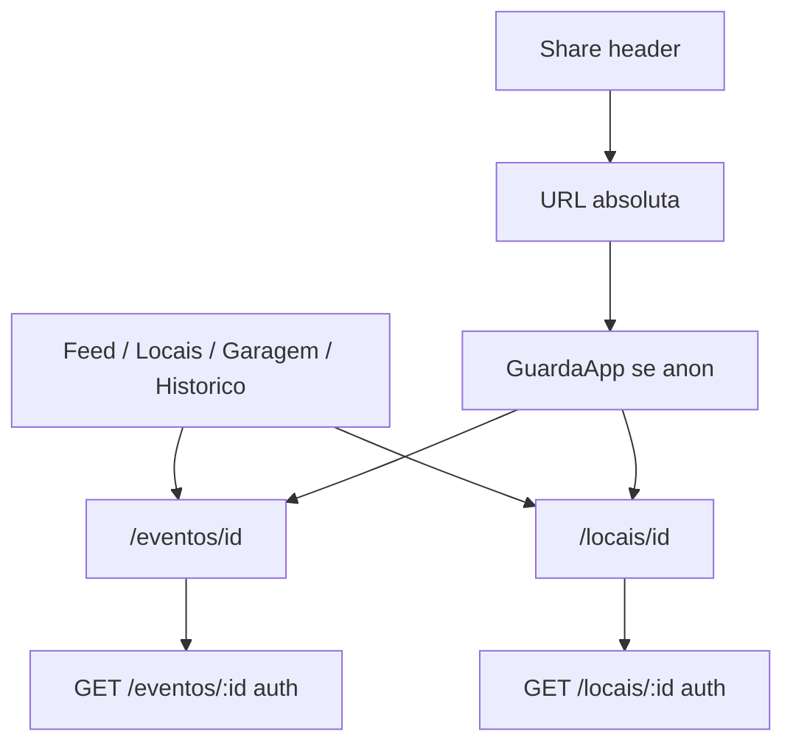

# SPEC 031 — Detalhes do Evento e do Local

> **Status:** Proposta  
> **Autor:** Assistente IA  
> **Data:** 2026-09-20  
> **Referência visual:** `designs/detalhes-evento/` e `designs/detalhes-local/` (`DESIGN.md`, `code.html`, `screen.png`)  
> **Padrões:** Next.js 15 App Router — Server Components por padrão, Client só com interatividade (skill `nextjs-patterns`)  
> **Backend:** Cloud Function `api` (Express) — enriquecer `GET /locais/:id`; reusar `GET /eventos/:id` e rotas de inscrição / favorito / avaliação  
> **Coleções Firestore:** `eventos`, `locais`, `usersevento`, `userslocalfavorito`, `userseventofeedback`, `userslocalfeedback` (nenhuma coleção nova)  
> **Depende de:** SPEC 001 (shell + GuardaApp), SPEC 015 (padrão Web Share — **sem** landing pública), SPEC 019 (Maps), SPEC 022 / 023 (schemas), SPEC 024 (feed + cards), SPEC 026 (inscrição + detalhe mínimo de evento), SPEC 027 (avaliações), SPEC 028 (favorito + garagem), SPEC 030 (§8.2 share autenticado)  
> **Fecha gaps de:** SPEC 022 §13 / 023 §9.7 / 024 §10 / 026 §2.2 (detalhe rico de evento e rota `/locais/[id]`)

---

## 1. Objetivo

Entregar **telas privadas de detalhe** para **evento** e **local**, alinhadas aos mocks em `designs/detalhes-evento/` e `designs/detalhes-local/`, mapeando só campos reais do schema.

O piloto autenticado abre o detalhe a partir do **feed** (abas Eventos / Locais), do **catálogo `/locais`**, da **garagem** e do **histórico**. No header, **Compartilhar** gera link absoluto da mesma origem — fácil de colar no WhatsApp. Colega sem sessão cai no login e, após autenticar, chega ao detalhe (`?next=`).



Esta spec é **full stack**:

| Camada | Responsabilidade |
|--------|------------------|
| Front (Next.js) | Redesign de `/eventos/[id]`; criar `/locais/[id]`; navegação nos cards; share; mapa estático + Maps; CTAs inscrição / favorito / avaliar |
| Back (Functions) | Enriquecer `GET /locais/:id` com `favorito`; manter contrato rico de `GET /eventos/:id` |

Não misturar com rolê (`roles` / `usersrole`) nem com landing pública de convite (SPEC 015 `/r/{id}`).

---

## 2. Recorte e princípios

### 2.1 O que entra

- Redesign visual de **`/eventos/[id]`** (hoje placeholder / detalhe mínimo da 026).
- Rota nova **`/locais/[id]`** (hoje só existe `/locais/[id]/avaliar`).
- Header sticky: Voltar · título · **Compartilhar** · avatar (padrão shell / mock).
- Share autenticado (Web Share → clipboard → fallback WhatsApp com texto + URL).
- Blocos de UI mapeados ao schema (§3).
- `MapaEstatico` + `BotaoAbrirMaps` / `urlAbrirMaps` (SPEC 019).
- Reuso de `BotaoInscreverEvento`, `BlocoParticipantes`, `SeloMediaAvaliacoes`, favorito local.
- Links **Avaliar / Ver reviews** → `/eventos/:id/avaliar` e `/locais/:id/avaliar` (SPEC 027).
- Navegação: thumb/título dos cards do feed, catálogo `/locais`, garagem (evento e local).
- Tipo `LocalDetalhe` no front e no back.

### 2.2 O que **não** entra (MVP)

| Item | Motivo |
|------|--------|
| Landing pública `/e/{id}` ou `/l/{id}` / OG tags | Tela privada; padrão 030, não 015 |
| Endpoints `GET /publico/eventos` / `publico/locais` | Sem leitura anônima |
| Lotes, preço R$, Sympla embutido, “benefícios inclusos” inventados | Fora do schema |
| Badges “Oficial da Irmandade”, “Homologado”, “Parada estratégica” | Marketing do mock sem campo |
| Sino de notificação / FCM de evento | Spec futura (013 / 020) |
| Banner WhatsApp gigante separado | Share só no header |
| Waze | App usa só Google Maps (019) |
| Duplicar `ListaAvaliacoes` no detalhe | Continua em `/avaliar` |
| Listagem dedicada `/eventos` | Feed aba Eventos basta |
| PUT / DELETE admin de evento/local | Fora (022 / 023) |
| Alterar Security Rules do client | Continua deny-all |
| Coleção nova | Nenhuma |

### 2.3 Princípios

1. **Privado primeiro.** Rotas no grupo `(app)`; Bearer obrigatório nos GETs.
2. **Mock guia visual; schema manda conteúdo.** Omitir ficção; não inventar campos.
3. **Share = link da app.** Colega autenticado vê o mesmo detalhe; anônimo passa pelo GuardaApp.
4. **Uma coisa por componente.** Feature folders + hooks + services (skill `nextjs-patterns`).
5. **Reusar, não reescrever.** Inscrição 026, avaliações 027, favorito 028, Maps 019, participantes já no GET.

### 2.4 Estado atual (baseline)

| Artefato | Hoje |
|----------|------|
| `/eventos/[id]` | Existe — `TelaDetalheEvento` mínima (capa, badges, inscrição, selo, `BlocoParticipantes`, link avaliar) |
| `/locais/[id]` | **Não existe** — só `/locais/[id]/avaliar` |
| `GET /eventos/:id` | Já retorna `inscrito`, `inscritos.total`, `avaliado`, `participantes` |
| `GET /locais/:id` | Retorna `Local` + `avaliado`; **sem** `favorito` |
| Feed `EventoCard` | Thumb/título → `/eventos/:id` |
| Feed / catálogo `LocalCard` | Sem link de detalhe; Maps + Avaliar |
| Garagem | Evento → detalhe; local → só `/avaliar` |

### 2.5 Relação com outras specs

| Spec | Papel |
|------|--------|
| **001** | Shell, dock, GuardaApp |
| **015** | Mecânica de share / texto WhatsApp — **sem** página pública nesta spec |
| **019** | `urlAbrirMaps`, `BotaoAbrirMaps` |
| **022** | Schema `eventos`; esta spec fecha o “detalhe visual” |
| **023** | Schema `locais` + `horarios[]`; esta spec cria `/locais/[id]` (proibido na 023) |
| **024** | Cards do feed; ajustar LocalCard para navegar ao detalhe |
| **026** | Inscrição + detalhe mínimo; esta spec **substitui o redesign** que a 026 deixou de fora |
| **027** | Agregados ★ + rotas `/avaliar` |
| **028** | Favorito; garagem ganha link “Ver local” |
| **030** | Padrão §8.2 de share autenticado |

---

## 3. Referência de Design

Replicar o **layout e atmosfera** de `designs/detalhes-evento/` e `designs/detalhes-local/`. Tokens em `DESIGN.md` / `globals.css`. **Não** copiar HTML do Stitch (Tailwind CDN) — CSS Modules + Barlow Condensed / Plus Jakarta Sans.

Layout: coluna única, gutter 16px, **max-width 560px**, fundo `surface` (`#121316`), cards `surface-container`, touch targets ≥ 48px (primários 56px).

### 3.1 Detalhe do evento — o que entra do mock

| Seção UI | Campos / comportamento |
|----------|------------------------|
| Header | Voltar · **Detalhes do evento** · Share · avatar |
| Hero capa | `fotoCapaUrl` (placeholder ícone se vazio); gradiente inferior |
| Badges na capa | Label de `tipo` (`OPCOES_TIPO`); pill relativo até abertura (“Faltam N dias” / “Hoje” / “Encerrado”) |
| Título | `titulo` uppercase `headline-lg` |
| Data / hora | Card com `calendar_today`; data por extenso + abertura; se `dataHoraEncerramento` → “até …” |
| Acesso | Badge `LABELS_ACESSO_EVENTO` (`gratis` / `ingresso`) |
| Ingresso | Só se `acesso === "ingresso"` e há `linkIngresso`: card + CTA **Comprar ingresso (site oficial)** (`open_in_new`) |
| Atrações | Lista `atracoes[]` com labels/ícones de `OPCOES_ATRACOES` |
| Informações | Bloco texto se `informacoes.trim()` |
| Localização | `local.nome`, `local.endereco`, `MapaEstatico(lat,lng)`, `BotaoAbrirMaps` |
| Presenças | `BlocoParticipantes` (já existente) + contagem |
| CTA inscrição | `BotaoInscreverEvento` (estados inscrito / cancelar / modal ingresso da 026) |
| Avaliações | `SeloMediaAvaliacoes` se `totalAvaliacoes > 0`; link Avaliar / Ver avaliação |

### 3.2 Detalhe do evento — desvios do mock

| Mock | Nesta spec | Por quê |
|------|------------|---------|
| “Oficial da Irmandade” / “Confirmado” | Omitir | Sem campo |
| “Lote 2 vendendo rápido” / preço R$ 20 | Omitir | Sem lotes/preço no schema |
| Benefícios inventados + Sympla “credenciada” | Só CTA externo se `ingresso` | Link real do organizador |
| “70 pilotos” + copy “comboios em formação” | `BlocoParticipantes` + total real | Sem inventar comboios; PII via fluxo já existente |
| Sino de notificação | Omitir | Sem FCM nesta spec |
| Banner WhatsApp hiper-CTA | Share no header | Consistência com 030 |
| Waze + Maps grid | Só Google Maps | SPEC 019 |
| Micro-card organizador vazio no HTML | Omitir ou link futuro a `/perfil/[criadorId]` **fora do MVP** | Sem card no mock útil |

### 3.3 Detalhe do local — o que entra do mock

| Seção UI | Campos / comportamento |
|----------|------------------------|
| Header | Voltar · **Detalhes do local** · Share · avatar |
| Hero fachada | `fotoFachadaUrl` (placeholder por categoria se vazio) |
| Badge aberto | “Aberto agora” / “Fechado” / “24 horas” via helper client (§6.3) |
| Favorito | Toggle no hero (`favorite` / `favorite_border`) — mesmo endpoint 028 |
| Categoria | Pill com `LABELS_CATEGORIA_LOCAL` + ícone |
| Título | `nome` uppercase |
| ★ + reviews | `notaMedia`, `totalAvaliacoes`; link **Ver reviews** → `/locais/:id/avaliar` |
| Horários | Se `aberto24h` → card único “Aberto 24 horas”; senão lista dos 7 dias (`HorarioDiaLocal`), agrupando dias consecutivos com mesma faixa |
| Facilidades | Lista **completa** `facilidades[]` com labels/ícones de `OPCOES_FACILIDADES` |
| Localização | `endereco` + `MapaEstatico` + Abrir no Maps (`linkMaps` se preenchido, senão coords) |
| Avaliar | Link / botão secundário para `/locais/:id/avaliar` conforme `avaliado` |

### 3.4 Detalhe do local — desvios do mock

| Mock | Nesta spec | Por quê |
|------|------------|---------|
| “Homologado Rolê Moto” / “Parada estratégica oficial” | Omitir | Sem campo |
| Subtítulos fictícios (“Manutenção da Pista”, “Pico de Rolês”) | Só dia + faixa ou “Fechado” | Schema não tem copy por dia |
| Bookmark genérico | Preferir ícone **favorite** alinhado ao feed (coração) | SPEC 028 |
| Overlay “Acesso direto pista…” no mapa | Omitir | Sem campo |
| Avaliar abrindo “modal” no HTML | Navegar para `/locais/:id/avaliar` | SPEC 027 |
| Share só WhatsApp hardcoded | Web Share + clipboard + fallback WA | SPEC 030 |

### 3.5 Copy sugerida

| Momento | Texto |
|---------|--------|
| Share evento | Título = `titulo`; texto curto + URL `/eventos/{id}` |
| Share local | Título = `nome`; texto curto + URL `/locais/{id}` |
| Toast share clipboard | Link copiado |
| Countdown | `Faltam N dias` / `Faltam N h` / `Começa em breve` / `Encerrado` |
| Ingresso CTA | Comprar ingresso (site oficial) |
| Local 24h | Aberto 24 horas |
| Favorito erro | Reusar `ERRO_FAVORITO` do feed |

---

## 4. Fluxo do usuário

### 4.1 Abrir detalhe do evento

```
Feed aba Eventos (thumb/título) ou Garagem / Histórico
  → /eventos/{id}
  → GET /eventos/:id
  → render hero + blocos
  → Inscrever / Cancelar (026)
  → Compartilhar (opcional)
  → Avaliar se inscrito + encerrado
```

### 4.2 Abrir detalhe do local

```
Feed aba Locais ou /locais (thumb/título) ou Garagem
  → /locais/{id}
  → GET /locais/:id (com favorito)
  → render hero + horários + facilidades + mapa
  → Favoritar / Desfavoritar
  → Abrir no Maps
  → Ver reviews / Avaliar
```

### 4.3 Compartilhar (WhatsApp / nativo)

```
Header → Compartilhar
  → se navigator.share → sheet nativo (WhatsApp entra aí)
  → senão clipboard.writeText(url) + toast
  → fallback opcional: api.whatsapp.com/send?text=...
  → colega abre URL
  → sem sessão → GuardaApp → login?next=/eventos|locais/{id}
  → com sessão → detalhe
```

### 4.4 Erros

| Situação | Comportamento |
|----------|----------------|
| 404 | Empty state “Evento/Local indisponível” + Voltar ao Feed |
| 401 | GuardaApp / redirect login |
| Share cancelado pelo SO | Silencioso |
| Favorito falha | Toast `ERRO_FAVORITO`; reverter UI otimista |
| Sem `linkIngresso` e acesso ingresso | Esconder CTA externo; inscrição 026 já trata modal |

---

## 5. Arquitetura front

### 5.1 Pastas (skill `nextjs-patterns`)

```
src/app/(app)/eventos/[id]/
├── page.tsx                          # orquestrador fino
├── evento-detalhe.module.css
├── components/
│   ├── TelaDetalheEvento.tsx         # compõe seções
│   ├── CabecalhoDetalheEvento.tsx
│   ├── HeroEvento.tsx
│   ├── BlocoDataEvento.tsx
│   ├── BlocoIngressoEvento.tsx
│   ├── BlocoAtracoesEvento.tsx
│   ├── BlocoLocalizacaoEvento.tsx
│   └── ...
├── hooks/
│   ├── useDetalheEvento.ts
│   └── useCompartilharEvento.ts
└── services/
    └── evento-detalhe.service.ts     # já existe — manter

src/app/(app)/locais/[id]/
├── page.tsx
├── local-detalhe.module.css
├── avaliar/                          # já existe — não mover
├── components/
│   ├── TelaDetalheLocal.tsx
│   ├── CabecalhoDetalheLocal.tsx
│   ├── HeroLocal.tsx
│   ├── BlocoHorariosLocal.tsx
│   ├── BlocoFacilidadesLocal.tsx
│   ├── BlocoLocalizacaoLocal.tsx
│   └── ...
├── hooks/
│   ├── useDetalheLocal.ts
│   ├── useFavoritoLocalDetalhe.ts    # ou reusar hook do feed
│   └── useCompartilharLocal.ts
└── services/
    └── local-detalhe.service.ts
```

Helpers compartilháveis (se caber sem over-engineering):

- `src/lib/horario-local.ts` — `estaAbertoAgora(local)`, `agruparHorarios(horarios)`
- `src/lib/compartilhar.ts` — ou hooks espelhando `useCompartilharTelemetria`

### 5.2 Regras Next.js

- `page.tsx` só monta a tela; sem lógica de fetch.
- `"use client"` só em componentes com estado, share, favorito, inscrição, mapa.
- Componentes ~≤ 80 linhas.
- CSS Modules + tokens; sem Tailwind CDN.
- `MapaEstatico` reutilizado de `src/components/maps/`.

### 5.3 Navegação a ajustar

| Origem | Ação |
|--------|------|
| `feed/components/EventoCard` | Manter link detalhe (já existe) |
| `feed/components/LocalCard` | Thumb/título → `/locais/{id}` (novo) |
| `locais/components/LocalCard` | Idem |
| `meus-roles/CardMeuLocal` | CTA “Ver local” → `/locais/{id}` além de Avaliar |
| `meus-roles/CardMeuEvento` | Manter `hrefDetalheEvento` |
| Histórico perfil | Eventos futuros → detalhe (já); locais se houver entrada → detalhe |

---

## 6. Contratos API

### 6.1 `GET /eventos/:id` (sem mudança de contrato)

Auth Bearer. Resposta = `EventoDetalhe`:

```ts
type EventoDetalhe = Evento & {
  inscrito: boolean;
  inscritos: { total: number };
  avaliado: boolean;
  participantes: ParticipantesBloco;
};
```

Campos de `Evento` usados na UI: `titulo`, `tipo`, `local`, `dataHoraAbertura`, `dataHoraEncerramento`, `acesso`, `linkIngresso`, `atracoes`, `fotoCapaUrl`, `informacoes`, `notaMedia`, `totalAvaliacoes`, `recomendacoesComboio` (opcional exibir se > 0).

Subrotas **reusadas** (sem alteração nesta spec):

- `POST|GET|DELETE /eventos/:id/inscricao`
- `GET|POST /eventos/:id/avaliacoes`, `GET /eventos/:id/avaliacao`
- Participantes (endpoint já usado por `ModalParticipantes`)

### 6.2 `GET /locais/:id` (ajuste)

Auth Bearer. Hoje:

```ts
{ ...Local, avaliado: boolean }
```

Passar a:

```ts
type LocalDetalhe = Local & {
  avaliado: boolean;
  favorito: boolean;
};
```

Implementação: no handler de `locaisRouter.get("/:id")`, além do feedback, consultar `usuarioLocalFavoritoRepository` (mesmo padrão de `marcarAvaliadosEFavoritos` na listagem).

Subrotas **reusadas**:

- `POST|DELETE /locais/:id/favorito`
- `GET|POST /locais/:id/avaliacoes`, `GET /locais/:id/avaliacao`

### 6.3 `abertoAgora` (client)

**Não** adicionar campo na API no MVP. Helper no front:

```
se aberto24h → true
senão → dia = getDay() no timezone do device
        achar horarios[dia]
        se fechado → false
        se abertura/fechamento → intervalo (suportar fecha < abre = vira a noite)
```

Expor `estaAbertoAgora(local): boolean` e label UI (“Aberto agora” / “Fechado” / “24 horas”).

### 6.4 Sem endpoints novos

Não criar:

- `GET /publico/eventos/:id` / `publico/locais/:id`
- Contagem/listagem extra de inscritos além do já existente
- Campos de preço / lote

---

## 7. Compartilhar

Espelhar SPEC 030 §8.2 e o padrão de `useCompartilharTelemetria` / `useCompartilharConvite`:

1. `navigator.share({ title, text, url })` se disponível.
2. Senão `clipboard.writeText(url)` + toast “Link copiado”.
3. Fallback opcional: `https://api.whatsapp.com/send?text=${encodeURIComponent(texto + " " + url)}`.

| Alvo | URL absoluta |
|------|----------------|
| Evento | `{origin}/eventos/{id}` |
| Local | `{origin}/locais/{id}` |

- Visível para **qualquer autenticado** que vê o detalhe (não só o criador).
- Sem rota curta pública, sem OG tags nesta spec.
- Texto sugerido curto (emoji ok no WA); não vazar lat/lng no texto — só nome/título + URL.

Login: garantir que GuardaApp preserve `next` para deep link pós-auth (mesmo comportamento das rotas `(app)` atuais).

---

## 8. Tipos front

Em `src/types/local.ts`:

```ts
export type LocalDetalhe = Local & {
  avaliado: boolean;
  favorito: boolean;
};
```

`EventoDetalhe` em `src/types/evento.ts` **já existe** — manter.

Espelhar `LocalDetalhe` em `functions/src/types/local.ts` se o back tipar a resposta.

---

## 9. Critérios de aceite

### UI — Evento

- [ ] `/eventos/[id]` segue hierarquia visual do mock (hero, data, ingresso condicional, atrações, localização com mapa, presenças, CTA inscrição).
- [ ] Sem badges/lotes/preços inventados.
- [ ] Header com Voltar + Share funcionando.
- [ ] Countdown / Encerrado coerente com `dataHoraAbertura` / encerramento.
- [ ] `acesso === "ingresso"` mostra CTA externo só com `linkIngresso`.
- [ ] `BotaoInscreverEvento` e `BlocoParticipantes` operacionais.
- [ ] Selo ★ + link para `/eventos/:id/avaliar` conforme regras 027.

### UI — Local

- [ ] Rota `/locais/[id]` existe e renderiza hero, horários, facilidades, mapa, favorito.
- [ ] Sem “Homologado” / subtítulos fictícios por dia.
- [ ] `aberto24h` e `horarios[]` exibidos corretamente; badge aberto/fechado via helper.
- [ ] Favorito otimista + `POST|DELETE /favorito`.
- [ ] Thumb/título no feed e catálogo abrem o detalhe.
- [ ] Garagem: CTA Ver local → detalhe.

### Share / auth

- [ ] Share usa Web Share ou clipboard; URL absoluta correta.
- [ ] Anônimo abrindo o link é levado ao login e retorna ao detalhe.
- [ ] Autenticado abre o detalhe direto.

### API

- [ ] `GET /locais/:id` inclui `favorito: boolean`.
- [ ] `GET /eventos/:id` inalterado em contrato (campos já suficientes).
- [ ] Sem endpoints públicos novos; client sem Firestore.

### Código limpo

- [ ] Feature folders; componentes ~≤ 80 linhas; hooks para estado; services para HTTP.
- [ ] CSS Modules + tokens; sem Tailwind CDN do mock.
- [ ] `page.tsx` orquestrador fino.

---

## 10. Fora de escopo (resumo)

- Landing / OG / preview rico no WhatsApp sem login (SPEC 015 de rolê).
- Waze, FCM, edição admin, waitlist, preço/lote.
- Lista de avaliações embutida no detalhe (permanece em `/avaliar`).
- Página `/eventos` de catálogo.
- Expor `criadorId` como card de organizador (pode ser spec futura + perfil 025).

---

## 11. Ordem sugerida de implementação

1. Backend: enriquecer `GET /locais/:id` + tipo `LocalDetalhe`.
2. Helper `horario-local` + testes unitários leves.
3. Feature `/locais/[id]` (tela completa) + links nos cards / garagem.
4. Redesign `/eventos/[id]` (quebrar `TelaDetalheEvento` em seções).
5. Hooks de compartilhar evento/local.
6. Ajustes de copy / empty states / aceite manual mobile + WhatsApp.

---

## 12. Checklist rápido pré-merge (implementação)

- [ ] Designs `detalhes-evento` e `detalhes-local` cobertos nos pontos §3.1 / §3.3.
- [ ] Desvios §3.2 / §3.4 respeitados (sem ficção).
- [ ] Share autenticado §7.
- [ ] Navegação feed + `/locais` + garagem.
- [ ] Skill `nextjs-patterns` cumprida.
`)