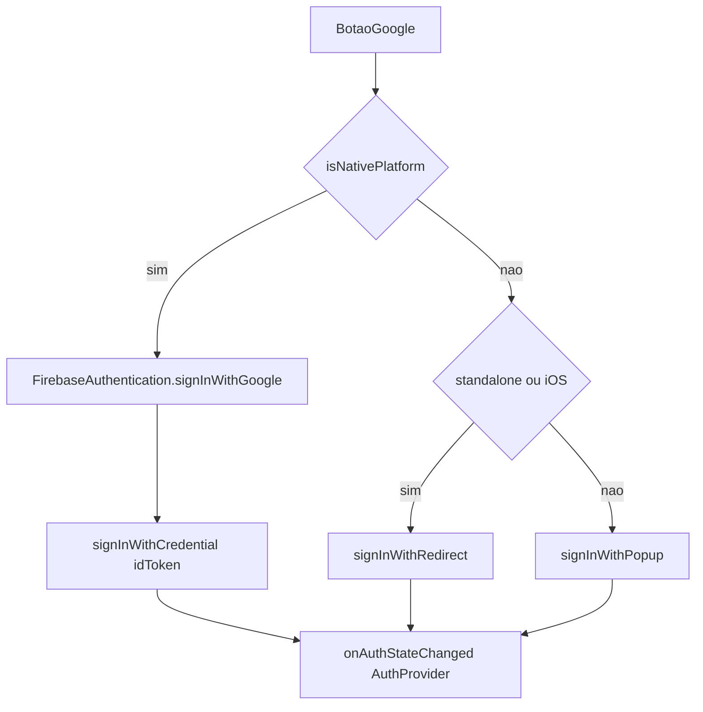

# SPEC 040 — Google Sign-In nativo (Capacitor)

> **Status:** Em implementação  
> **Autor:** Assistente IA  
> **Data:** 2026-09-21  
> **Origem:** APK Capacitor — login Google falha no WebView (`signInWithPopup` / user-agent bloqueado)  
> **Padrões:** Next.js 15 + Capacitor 8 + Firebase JS SDK  
> **Backend:** nenhum (Auth só no client; API continua Bearer do JS SDK)  
> **Depende de:** SPEC 012 §7 (auth Google web/PWA — **estende**, não revoga), SPEC 029 / `docs/mobile.md` (shell Capacitor URL remota)  
> **QA:** IDs **S1**, **S2**, **S3** — fechar **S1** primeiro

---

## 1. Objetivo

Fazer o botão **Continuar com Google** funcionar no app nativo (Capacitor Android/iOS) via **Google Sign-In nativo**, mantendo o mesmo fluxo web/PWA da SPEC 012.

Um botão, três caminhos; a sessão canônica continua no **Firebase JS SDK** (`AuthProvider` / `onAuthStateChanged` / token Bearer).

| ID | Entrega | Camada |
|----|---------|--------|
| **S1** | Android: Google nativo → `signInWithCredential` | Front + config Firebase/Android |
| **S2** | iOS: Google nativo → `signInWithCredential` | Front + config Firebase/iOS |
| **S3** | Regressão web/PWA: popup / redirect intactos | Front |

---

## 2. IDs de teste

| ID | Área | Severidade | Sintoma | Critério de aceite | Como testar |
|----|------|------------|---------|--------------------|-------------|
| **S1** | APK Android | Crítica | Google não abre / popup bloqueado / `disallowed_useragent` | Conta picker nativo → sessão JS → perfil / primeiro acesso | Build debug com SHA-1 no Firebase; botão Google no APK |
| **S2** | IPA / Simulator iOS | Alta | Mesmo sintoma no WebView iOS | Mesmo fluxo nativo; URL scheme `REVERSED_CLIENT_ID` ok | `npx cap sync ios` + Run; botão Google |
| **S3** | Browser + PWA | Alta | Regressão após branch nativo | Desktop: popup; PWA standalone / iOS Safari: redirect + `getRedirectResult` | Chrome desktop; PWA instalado; Safari iPhone |

---

## 3. Por que quebra hoje

Em [`src/lib/auth.ts`](../../src/lib/auth.ts):

1. Capacitor carrega `https://www.rolemoto.com.br` no WebView (`capacitor.config.ts` / opção B em `docs/mobile.md`).
2. `loginComGoogle` usa `signInWithPopup` (Firebase web).
3. `deveUsarRedirect()` só detecta PWA `standalone` — **não** `Capacitor.isNativePlatform()`.
4. Google bloqueia OAuth em WebView embutido → popup bloqueado / user-agent recusado.

E-mail/senha no APK **não** depende deste bug (fluxo JS direto).

---

## 4. Decisões travadas

| Decisão | Escolha |
|---------|---------|
| Plugin | `@capacitor-firebase/authentication` **8.x** (Capacitor ≥ 8) |
| Sessão canônica | Firebase **JS SDK** (`AuthProvider`) |
| Ponte nativa | `signInWithGoogle({ skipNativeAuth: true })` → `GoogleAuthProvider.credential(idToken)` → `signInWithCredential` |
| Web / PWA | Regras SPEC 012 §7; **não** chama o plugin |
| E-mail/senha | Inalterado |
| Ordem QA | **S1** → **S2** → **S3** |

`skipNativeAuth: true` na chamada nativa: o plugin só obtém o token Google; quem autentica no app é o JS SDK (mesmo `uid` / Bearer / perfil).

---

## 5. Fluxo



---

## 6. Contrato front

### 6.1 `loginComGoogle` — [`src/lib/auth.ts`](../../src/lib/auth.ts)

```ts
import { Capacitor } from "@capacitor/core";
import {
  GoogleAuthProvider,
  signInWithCredential,
  signInWithPopup,
  signInWithRedirect,
} from "firebase/auth";

export const loginComGoogle = async () => {
  if (Capacitor.isNativePlatform()) {
    const { FirebaseAuthentication } = await import(
      "@capacitor-firebase/authentication"
    );
    const resultado = await FirebaseAuthentication.signInWithGoogle({
      skipNativeAuth: true,
    });
    const idToken = resultado.credential?.idToken;
    if (!idToken) throw new Error("Token Google ausente");
    const credential = GoogleAuthProvider.credential(idToken);
    const cred = await signInWithCredential(auth, credential);
    return cred.user;
  }

  if (deveUsarRedirect()) {
    await signInWithRedirect(auth, googleProvider);
    return;
  }

  const resultado = await signInWithPopup(auth, googleProvider);
  return resultado.user;
};
```

- Usar `Capacitor.isNativePlatform()` (mesmo critério de [`src/lib/telemetria/plataforma.ts`](../../src/lib/telemetria/plataforma.ts)).
- Dynamic import do plugin evita quebrar o bundle web se o nativo não existir no browser.
- Remover `console.log` de debug atuais em `loginComGoogle` nesta entrega.

### 6.2 Persistência nativa — [`src/lib/firebase.ts`](../../src/lib/firebase.ts)

No Capacitor, o plugin recomenda `initializeAuth` + `indexedDBLocalPersistence` em vez de só `getAuth()`:

```ts
import { Capacitor } from "@capacitor/core";
import {
  getAuth,
  initializeAuth,
  indexedDBLocalPersistence,
} from "firebase/auth";

export const auth = Capacitor.isNativePlatform()
  ? initializeAuth(app, { persistence: indexedDBLocalPersistence })
  : getAuth(app);
```

Guardar contra double-init (HMR / SSR): se `getAuth(app)` já existir, reutilizar.

### 6.3 Logout

Em `logout` ([`src/lib/auth.ts`](../../src/lib/auth.ts)):

1. Remover FCM (já).
2. Se nativo: `await FirebaseAuthentication.signOut()` (best-effort).
3. `await signOut(auth)`.

Sem o passo nativo, a conta Google pode permanecer “grudada” no picker.

### 6.4 `AuthProvider`

Sem mudança de contrato: continua `getRedirectResult` + `onAuthStateChanged`. O caminho nativo alimenta o mesmo listener via `signInWithCredential`.

UI (`BotaoGoogle`) inalterada — só chama `loginComGoogle()`.

---

## 7. Config nativa (checklist)

### 7.1 Dependência e Capacitor

```bash
npm install @capacitor-firebase/authentication@^8.5.2
npx cap sync
```

Em [`capacitor.config.ts`](../../capacitor.config.ts):

```ts
plugins: {
  FirebaseAuthentication: {
    providers: ["google.com"],
  },
},
```

Não setar `skipNativeAuth: true` global se e-mail/senha nativo não for usado pelo plugin — a flag vai **por chamada** no Google (já no §6.1).

### 7.2 Android (S1)

| Item | Detalhe |
|------|---------|
| Package | `br.com.rolemoto.app` (já no projeto) |
| Firebase Console | App Android com esse package |
| SHA-1 | Debug keystore **e** release; na Play, SHA de **App signing** |
| `google-services.json` | Em `android/app/` (gitignored; Gradle já aplica o plugin se existir) |
| `android/variables.gradle` | `rgcfaIncludeGoogle = true` (+ `androidxCredentialsVersion` se o README do plugin exigir) |
| Sync | `npx cap sync android` / `npx cap update` após a flag |

Sintoma clássico de SHA errado: `DEVELOPER_ERROR` / sheet fecha na hora.

### 7.3 iOS (S2)

| Item | Detalhe |
|------|---------|
| Bundle ID | `br.com.rolemoto.app` |
| `GoogleService-Info.plist` | No target iOS |
| URL Types | Scheme = `REVERSED_CLIENT_ID` do plist |
| CocoaPods | Se o projeto usa pods: `pod 'CapacitorFirebaseAuthentication/Google', :path => '...'` (fora de `capacitor_pods`) |
| Sync | `npx cap sync ios` |

### 7.4 Firebase Auth (já esperado)

- Provedor **Google** habilitado (Authentication → Sign-in method).
- Domínios autorizados do site (`rolemoto.com.br`, `www.rolemoto.com.br`) — mantidos para web/PWA.

---

## 8. Checklist

- [ ] **S1:** APK debug — Google nativo → logado → `GET /perfil` ou primeiro acesso.
- [ ] **S1:** Logout limpa sessão JS e conta nativa (próximo login pede conta de novo se só havia uma).
- [ ] **S2:** iOS — mesmo fluxo com URL scheme configurado.
- [ ] **S3:** Chrome desktop — popup Google.
- [ ] **S3:** PWA standalone — redirect + retorno com sessão.
- [ ] E-mail/senha inalterado no web e no APK.
- [ ] Sem `console.log` de debug em `loginComGoogle`.
- [ ] `docs/mobile.md` menciona auth nativo Google (nota curta; opcional nesta PR).

---

## 9. Fora de escopo

- Apple Sign-In / Facebook / outros providers.
- Trocar modelo URL remota do Capacitor por `output: 'export'`.
- Mudança em Cloud Functions / regras Firestore.
- Publicar na Play/App Store (só pré-requisitos SHA / plist).
- Remover fluxo redirect da SPEC 012 (ainda necessário no PWA).

---

## 10. Relação com specs anteriores

| Spec | Relação |
|------|---------|
| **012** §7 | **Estende** — web/PWA iguais; Capacitor ganha ramo nativo |
| **029** / `mobile.md` | Shell nativo; auth deixa de ser “só Firebase web no WebView” para Google |
| **039** | Excluir conta: Google no próximo login continua criando uid novo via JS SDK |

---

## 11. Ordem de implementação sugerida

1. Dependência + `capacitor.config` + `variables.gradle` + Firebase SHA / `google-services.json`.
2. `firebase.ts` (persistência nativa) + `auth.ts` (branch + logout).
3. `npx cap sync android` → aceitar **S1**.
4. Config iOS → aceitar **S2**.
5. Smoke **S3** no browser/PWA.
