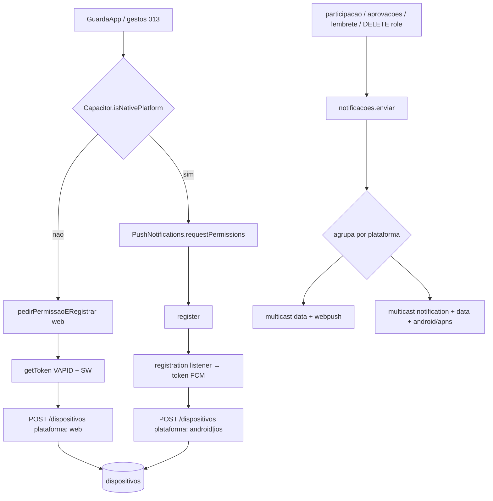

# SPEC 042 — Push nativo Capacitor (híbrido web + loja)

> **Status:** Proposta  
> **Autor:** Assistente IA  
> **Data:** 2026-09-23  
> **Origem:** APK Capacitor — solicitar vaga não dispara card nativo; Web Push (SPEC 013) não roda de forma confiável no WebView  
> **Padrões:** Next.js 15 + Capacitor 8 + FCM (Admin SDK nas Functions)  
> **Backend:** `POST|DELETE /dispositivos` + `lib/notificacoes.ts` (estende SPEC 013 / 020 / 034)  
> **Coleção Firestore:** `dispositivos` (estende schema)  
> **Depende de:** SPEC 013 (push web + `dispositivos`), SPEC 012 (PWA/SW), SPEC 040 (Capacitor + Firebase nativo), `docs/mobile.md` (shell URL remota)  
> **QA:** IDs **K1**, **K2**, **K3**, **K4** — fechar **K1** primeiro

---

## 1. Objetivo

Fazer as mesmas notificações da SPEC 013 (e lembrete / cancelamento) chegarem **nos dois canais de distribuição**:

| Canal | Como o piloto “instala” | Como recebe push |
|-------|-------------------------|------------------|
| **Web / PWA** | Browser ou “Adicionar à tela inicial” | Web Push atual (VAPID + Serwist / `sw.ts`) |
| **Loja / APK** | Play Store (e depois App Store) via Capacitor | FCM **nativo** (`@capacitor/push-notifications`) |

Um produto, **dois registradores de token**, **uma coleção** `dispositivos`, **um orquestrador** `notificacoes.ts`. Tipos de push **não mudam** (`pedido_vaga`, `aceite_vaga`, `lembrete_role`, `cancelamento_role`). Copy e deep links da 013/020/034 permanecem.

| ID | Entrega | Camada |
|----|---------|--------|
| **K1** | Android APK: token nativo → `dispositivos` → card no pedido de vaga | Front nativo + back payload |
| **K2** | Backend distingue `web` vs `android`/`ios` no envio FCM | Functions |
| **K3** | Clique na notificação (app morto / background) abre deep link no WebView | Front Capacitor |
| **K4** | Regressão web/PWA: pedido/aceite/lembrete/cancelamento intactos | Front web + SW |

---

## 2. IDs de teste

| ID | Área | Severidade | Sintoma | Critério de aceite | Como testar |
|----|------|------------|---------|--------------------|-------------|
| **K1** | APK Android | Crítica | Pediu vaga e líder no APK não vê nada | Conta líder no APK com permissão + doc em `dispositivos` (`plataforma: android`) recebe title/body de `pedido_vaga` com app em background ou morto | 2 contas; líder no APK; piloto pede vaga; app do líder fechado |
| **K2** | Functions | Alta | Token nativo registrado mas send “some” | Log Push: tokens > 0, sucesso ≥ 1; payload nativo inclui `notification` | Logs prod/emulator (emulator **não** dispara FCM — testar Functions deployadas) |
| **K3** | Deep link APK | Alta | Tocou no card e abriu Chrome / tela errada | Abre o Capacitor na `url` do payload (`/aprovacoes`, `/roles/:id/participar`, `/meus-roles`) | App morto → tocar notificação |
| **K4** | Chrome / PWA | Alta | Regressão após payload híbrido | Web continua recebendo (SW desenha card); sem engolir push com app em 2º plano | Mesmo fluxo K1 com líder só no Chrome/PWA |

---

## 3. Por que quebra hoje

Baseline (SPEC 013, código atual):

1. Front só registra via `firebase/messaging` + VAPID + service worker (`src/lib/fcm.ts`, `useRegistroFcm`).
2. Capacitor carrega `https://www.rolemoto.com.br` no WebView (`capacitor.config.ts`) — **não** é Chrome Push; `isSupported()` / SW costumam falhar ou não entregar card nativo.
3. `lib/notificacoes.ts` envia **só `data` + `webpush.headers`** (de propósito: `webpush.notification` fazia o Chrome engolir o card). No Android **nativo**, mensagem só-`data` **não desenha** notificação com o app morto.
4. Não há `@capacitor/push-notifications` no `package.json`. `POST_NOTIFICATIONS` já está no `AndroidManifest.xml`; o Gradle já menciona `google-services.json` — falta o plugin + registro + payload.

Quem recebe `pedido_vaga` continua sendo o **organizador** (`criadorId`), não quem pediu a vaga (013).

---

## 4. Decisões travadas

| Decisão | Escolha |
|---------|---------|
| Plugin nativo | `@capacitor/push-notifications` **8.x** (alinhado ao Capacitor 8 do repo) |
| Alternativa rejeitada nesta spec | `@capacitor-firebase/messaging` — possível depois; oficial Capacitor basta com `google-services.json` + FCM |
| Sessão / API | Continua Firebase JS + Bearer; push **não** muda Auth |
| Coleção | Continua `dispositivos`; id = token; **novo** campo `plataforma` |
| Web / PWA | Mantém caminho 013 (`fcm.ts` + `sw.ts`); **não** chama o plugin |
| Capacitor | **Só** plugin nativo; **não** tenta `getToken` web no native |
| Envio FCM | **Dois** formatos: web = data-only (atual); nativo = `notification` + `data` |
| Multicast | Separar tokens por plataforma e `sendEachForMulticast` **duas vezes** (mesmo payload lógico) — evita misturar formatos no mesmo multicast |
| iOS | **K1/K2/K3** focam Android; iOS na mesma arquitetura, QA **depois** (APNs + capabilities) — ver §11 |
| Emulator Functions | Continua **não** disparando FCM (`FUNCTIONS_EMULATOR`) — QA de push em Functions deployadas |
| Novos tipos de push | Fora — só canais de entrega |
| Sino / inbox in-app | Fora |

---

## 5. Fluxo



Deep link nativo:

```
pushNotificationActionPerformed
  → ler data.url (fallback "/")
  → App.getLaunchUrl / router ou window.location no WebView
  → mesma tabela de urls da 013/020/034
```

---

## 6. Contrato dos dados

### 6.1 `dispositivos` (estende)

```ts
// functions/src/types/dispositivo.ts
export type PlataformaDispositivo = "web" | "android" | "ios";

export type Dispositivo = {
  token: string;
  uid: string;
  plataforma: PlataformaDispositivo;
  createdAt: string;
  updatedAt: string;
};

export type DispositivoCreate = {
  token: string;
  /** Default `"web"` se omitido — docs antigos sem campo continuam válidos. */
  plataforma?: PlataformaDispositivo;
};
```

Firestore: `token`, `uid`, `plataforma`, `createdAt`, `updatedAt`.

| Regra | Comportamento |
|-------|----------------|
| Docs legados sem `plataforma` | Tratar como `"web"` na leitura / envio |
| `POST` sem `plataforma` | Persistir `"web"` (compat clients antigos) |
| Upsert mesmo token, outra plataforma | Atualiza `plataforma` + `uid` + `updatedAt` |
| Teto 10 tokens/uid | Mantém (repository atual) |

### 6.2 `POST /dispositivos`

Body:

```json
{ "token": "<fcm-token>", "plataforma": "android" }
```

| Caso | Status |
|------|--------|
| `token` inválido | 400 |
| `plataforma` presente e ≠ `web\|android\|ios` | 400 `{ erro: "plataforma inválida" }` |
| Ok | 201 / 200 + `Dispositivo` (inclui `plataforma`) |

`DELETE` inalterado (só `token`).

### 6.3 Payload FCM — web (inalterado na intenção)

```ts
{
  tokens: webTokens,
  data: { tipo, url, roleId, title, body, icon },
  webpush: { headers: { Urgency: "high", TTL: "86400" } },
}
```

Sem `notification` / `webpush.notification` no ramo web (evita regressão K4 / Chrome engolir).

### 6.4 Payload FCM — nativo (Android / iOS)

```ts
{
  tokens: nativeTokens,
  notification: { title, body },
  data: { tipo, url, roleId, title, body }, // strings; url para o clique
  android: {
    priority: "high",
    notification: {
      channelId: "rolemoto_push", // ver §8
      // clickAction opcional se o plugin exigir
    },
  },
  apns: {
    payload: {
      aps: { sound: "default" },
    },
  },
}
```

`icon` web não é obrigatório no nativo. Limpeza de tokens inválidos (`registration-token-not-registered` / `invalid-registration-token`) **igual** à 013.

### 6.5 Deep links (sem mudança)

| Tipo | `url` |
|------|-------|
| `pedido_vaga` | `/aprovacoes` |
| `aceite_vaga` | `/roles/{roleId}/participar` |
| `lembrete_role` | `/roles/{roleId}/participar` |
| `cancelamento_role` | `/meus-roles` |

---

## 7. Implementação front

### 7.1 Detecção

```ts
import { Capacitor } from "@capacitor/core";

const ehNativo = () => Capacitor.isNativePlatform();
const plataformaAtual = (): PlataformaDispositivo => {
  if (!ehNativo()) return "web";
  const p = Capacitor.getPlatform(); // "android" | "ios" | "web"
  if (p === "ios") return "ios";
  if (p === "android") return "android";
  return "web";
};
```

### 7.2 Service

Estender `dispositivos.service.ts`:

```ts
registrar: (token: string, plataforma: PlataformaDispositivo = "web") =>
  api<Dispositivo>("/dispositivos", {
    method: "POST",
    body: JSON.stringify({ token, plataforma }),
  }),
```

### 7.3 Módulo nativo — `src/lib/fcm-nativo.ts` (NOVO)

Responsabilidades:

1. `PushNotifications.requestPermissions()` → se não `granted`, return.
2. `PushNotifications.register()`.
3. Listener `registration` → `dispositivosService.registrar(token, plataformaAtual())`.
4. Listener `registrationError` → log warn (sem crash).
5. Listener `pushNotificationReceived` (foreground) → reusar toast in-app da 013 (`title`/`body` de `notification` ou `data`).
6. Listener `pushNotificationActionPerformed` → navegar para `data.url` (path relativo na origem do WebView).
7. Idempotência: registrar listeners **uma vez** por sessão (flag de módulo, igual espírito do `recusouNestaSessao` web).

Não logar o token em claro.

### 7.4 Unificar entrada — `useRegistroFcm` / `pedirPermissaoERegistrar`

| Ambiente | Ação |
|----------|------|
| Native | Chamar API do `fcm-nativo` (permissão + register) |
| Web | Caminho atual `fcm.ts` |

Gestos da 013 **permanecem** (após publicar rolê; ao participar / toggle notificar). No APK, o mesmo gesto dispara o prompt **nativo** de notificação (Android 13+).

`registrarSeJaPermitido` no shell: no native, se já `granted`, só `register()` de novo (garante token fresco após reinstall).

### 7.5 Logout / excluir conta

- Logout: obter token atual (web `obterToken` **ou** guardar último token nativo em memória/Preferences) → `DELETE /dispositivos` best-effort → `signOut` (como 013/040).
- Native: se não houver token em mão, best-effort `PushNotifications` remove all delivered; **não** bloquear logout.
- `DELETE /perfil` já apaga por uid — ok.

### 7.6 Dependências / sync

```bash
npm i @capacitor/push-notifications
npx cap sync android
```

Atualizar `android/capacitor.settings.gradle` / `android/app/capacitor.build.gradle` via sync.

---

## 8. Android (loja / APK)

| Item | Requisito |
|------|-----------|
| `google-services.json` | App Android `br.com.rolemoto.app` no Firebase; arquivo em `android/app/` (plugin Google Services já condicional no Gradle) |
| SHA-1 / SHA-256 | Debug + release no Firebase (já exigido pelo Google Sign-In 040) |
| Permissão | `POST_NOTIFICATIONS` já no manifest; runtime via plugin |
| Canal | Criar canal `rolemoto_push` (importância default/high) no boot nativo **ou** via config do plugin / `PushNotifications.createChannel` no register — obrigatório Android 8+ para o card aparecer |
| FCM | Cloud Messaging API habilitada no projeto Firebase |

Não misturar com a notificação persistente da telemetria Capgo (`Registrando seu rolê`) — canal/id distintos.

iOS (fase seguinte, mesma spec arquitetural): Push capability, chave APNs no Firebase, `GoogleService-Info.plist`, permissão via plugin.

---

## 9. Backend

### 9.1 Tipos + repository

- `upsert(uid, token, plataforma)` grava `plataforma`.
- `listarPorUid(uid)` devolve `{ token, plataforma }[]` (ou dois métodos). Preferível **um** método rico para o `enviar` agrupar.
- Docs sem campo → `plataforma: "web"`.

### 9.2 `lib/notificacoes.ts` — `enviar`

1. Listar dispositivos do uid.
2. Particionar `web` vs `android|ios`.
3. Se ambos vazios → warn `0 tokens` (já existe).
4. Se emulator → ignorar (já existe).
5. Multicast web com payload §6.3; multicast nativo com §6.4.
6. Limpar tokens inválidos; log sucesso/falha por ramo (`plataforma` no contexto do log).

Assinaturas públicas (`notificarPedidoVaga`, etc.) **não mudam**.

### 9.3 `APP_ORIGIN`

Continua opcional para ícone web / e-mail. Nativo não depende de `APP_ORIGIN` para desenhar o card.

---

## 10. Arquivos (mapa)

| Arquivo | Ação |
|---------|------|
| `docs/specs/042-push-nativo-capacitor.md` | Esta spec |
| `package.json` | + `@capacitor/push-notifications` |
| `src/lib/fcm-nativo.ts` | **NOVO** |
| `src/app/(app)/hooks/useRegistroFcm.ts` | Alterar — branch native/web |
| `src/app/(app)/services/dispositivos.service.ts` | Alterar — `plataforma` |
| `src/lib/auth.ts` / logout | Alterar — limpar token nativo best-effort |
| `functions/src/types/dispositivo.ts` | Alterar |
| `functions/src/repositories/.../dispositivo*` | Alterar upsert/listagem |
| `functions/src/routes/dispositivos.ts` | Validar `plataforma` |
| `functions/src/lib/notificacoes.ts` | Split web/nativo |
| `android/` | sync + channel + `google-services.json` |
| `docs/mobile.md` | Parágrafo push híbrido |
| `README.md` | Nota: loja = push nativo; PWA = VAPID |
| `docs/specs/032-039-indice-backlog.md` | Incluir 042 |

---

## 11. Ordem de entrega / QA

1. **K2** (backend split + `plataforma` no POST) pode ir antes do APK — clients antigos sem campo = web.
2. **K1** — APK Android build interno + Functions em prod/staging.
3. **K3** — deep link com app morto.
4. **K4** — regressão Chrome/PWA no mesmo ambiente.
5. iOS: mesmo código front; checklist separado (APNs) — não bloqueia K1.

Emulator Auth + API local: participação cria pedido, mas push **não** sai — não usar isso para fechar K1.

---

## 12. Checklist

- [ ] `POST /dispositivos` aceita e persiste `plataforma`
- [ ] Docs legados sem campo tratados como `web`
- [ ] APK: permissão → token → doc Firestore do líder
- [ ] K1: `pedido_vaga` com app do líder fechado
- [ ] Aceite / lembrete / cancelamento também chegam no APK (smoke)
- [ ] K3: clique abre path certo no WebView
- [ ] K4: PWA/Chrome sem regressão (card via SW)
- [ ] Logout não deixa token do uid anterior no device
- [ ] Canal Android `rolemoto_push` ≠ canal da telemetria
- [ ] `docs/mobile.md` + README atualizados

---

## 13. Fora de escopo

- Novos tipos de notificação (eventos, locais, marketing).
- Central / sino no header.
- Topics FCM / segmentos.
- Migrar autenticação push para `@capacitor-firebase/messaging`.
- Garantir Web Push dentro do WebView Capacitor (abandonado de propósito).
- iOS TestFlight como critério de aceite do MVP desta spec (arquitetura já preparada; QA iOS depois).
- Alterar quem recebe `pedido_vaga` (sempre organizador).

---

## 14. Relação com specs anteriores

| Spec | Relação |
|------|---------|
| **013** | Estende: segundo canal de registro + payload nativo; copy/eventos iguais |
| **020** / **034** | Passam a beneficiar tokens nativos automaticamente via `enviar` |
| **040** | Mesmo shell Capacitor; Firebase Android já parcialmente configurado |
| **012** | PWA/SW permanece para web; não é o caminho do APK |
| **041** | Notificação de GPS em foreground service é **outra** — não reutilizar canal |
