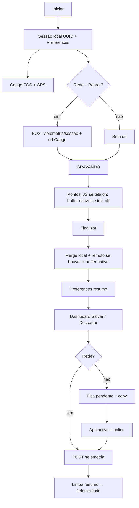

# SPEC 040 — Telemetria offline (gravação e save no device)

> **Status:** Implementado  
> **Autor:** Assistente IA  
> **Data:** 2026-09-28  
> **Origem:** APK — Iniciar / tela off / Salvar exigem API; na serra o passeio some. iOS (ex-040–046) espera esta base  
> **Padrões:** Capacitor 8 + `@capgo/background-geolocation` + Preferences + Cloud Functions  
> **Backend:** `POST /telemetria` inalterado; `POST /telemetria/sessao` vira **oportunista** (não é mais pré-requisito)  
> **Depende de:** SPEC 030 (gravação standalone), SPEC 041 (tela off via Capgo `url` — **revoga** “iniciar exige internet”)  
> **QA:** IDs **O1**, **O2**, **O3**, **O4** — fechar **O1** primeiro  
> **Substitui o número 040** que era Google Sign-In nativo (arquivo antigo: descartado; será reescrito depois desta spec)

---

## 1. Objetivo

O piloto **grava e guarda** o passeio **sem internet**. A nuvem só publica no perfil / dashboard compartilhado quando a rede voltar.

Hoje a 041 fez o contrário: sem `POST /telemetria/sessao` o GPS **nem liga**; com tela off os pontos só existem se o POST nativo Capgo chegar no Firestore.


| ID     | Entrega                                                       | Camada              |
| ------ | ------------------------------------------------------------- | ------------------- |
| **O1** | Iniciar sem API: sessão local + GPS                           | Adapter nativo      |
| **O2** | Tela off ≥ 10 min **sem dados** → distância > 0 ao Finalizar  | Nativo (buffer)     |
| **O3** | Finalizar e ver resumo sem `POST /telemetria`                 | Front + Preferences |
| **O4** | Rede volta → `POST /telemetria` → `/telemetria/:id` no perfil | Fila + sync         |


PWA / browser: **não** grava com tela off (030). Esta spec é **só Capacitor**.

---

## 2. IDs de teste


| ID     | Área  | Severidade | Sintoma                             | Critério de aceite                                                                   | Como testar                                              |
| ------ | ----- | ---------- | ----------------------------------- | ------------------------------------------------------------------------------------ | -------------------------------------------------------- |
| **O1** | APK   | Crítica    | “Verifique a internet” no Iniciar   | Modo avião (app **já aberto**) → Iniciar → estado GRAVANDO + notificação persistente | Device real; permissão Sempre; sem Wi‑Fi/4G              |
| **O2** | Campo | Crítica    | km congelam com tela off e sem rede | Após ≥ 10 min no bolso, Finalizar mostra distância > 0 e ≈ trajeto                   | O1 + apagar tela; **sem** dados móveis o passeio inteiro |
| **O3** | APK   | Alta       | Salvar falha e some o resumo        | Finalizar mostra dashboard; Preferences `resumo` intacto; copy honesta               | Continuar em avião; não chamar a API                     |
| **O4** | APK   | Alta       | Passeio nunca aparece no perfil     | Ligar 4G → sync automático **ou** toque em Salvar → 201 → `/telemetria/:id`          | O3 + rede; Functions alcançáveis                         |


**Não** fecha O1/O2: Chrome, iOS Simulator, Fake GPS sem tela off.

**Não** entra no aceite: cold start do Capacitor sem internet (WebView URL remota — §9).

---

## 3. Por que quebra hoje

`[src/lib/telemetria/telemetria-gps.native.ts](../../src/lib/telemetria/telemetria-gps.native.ts)`:

1. `start()` chama `abrirSessaoRemota()`; se falhar, lança `sessao_remota` e **não** chama Capgo.
2. Com sessão remota, Capgo POSTa cada fix em `POST /telemetria/sessao/:id/ponto`. A 041 admite: **não há fila offline**.
3. `aplicarPonto` → Preferences só no **callback JS**. Tela off congela o WebView → agregados locais não avançam.
4. `useGravarRole.salvar` só limpa o resumo após `POST /telemetria` 201. O retry manual da 030 existe no copy, mas **Iniciar** já bloqueou o fluxo.

Geocode no Finalizar já é best-effort (nome vazio se falhar) — manter.

---

## 4. Decisões travadas


| Decisão                                 | Escolha                                                                                                                                                                                                          |
| --------------------------------------- | ---------------------------------------------------------------------------------------------------------------------------------------------------------------------------------------------------------------- |
| Fonte da verdade                        | **Device** (sessão + resumo em Preferences; pontos/agregados nativos com tela off)                                                                                                                               |
| Servidor ao vivo (`/telemetria/sessao`) | **Opcional.** Se Bearer + rede no Iniciar, abre sessão e passa `url` ao Capgo (qualidade extra). Se falhar, grava **igual**                                                                                      |
| Capgo `url`                             | Nunca é pré-requisito de `start()`                                                                                                                                                                               |
| Tela off sem rede                       | Buffer **nativo** (não JS). Spike Capgo 8.4 (`getLocations` / arquivo / equivalente). Se o plugin não persistir histórico, agregar no nativo (extensão mínima do FGS — **não** voltar a depender do callback JS) |
| `POST /telemetria`                      | Mesmo contrato 030; chamado no save/sync, não no Iniciar                                                                                                                                                         |
| Auth no Iniciar                         | **Não** exige `getIdToken()`. Save posterior sim                                                                                                                                                                 |
| Token expirado no sync                  | Manter resumo; tentar de novo quando a sessão Firebase renovar; **não** apagar o passeio                                                                                                                         |
| PWA                                     | Inalterado (`webAdapter`)                                                                                                                                                                                        |
| Polyline                                | Fora (MVP continua A/B + métricas)                                                                                                                                                                               |
| Cold start sem site                     | Fora (§9)                                                                                                                                                                                                        |
| iOS loja / Google / APNs                | Fora — specs nativas serão reescritas **depois** desta                                                                                                                                                           |


Ordem QA: **O1** → **O3** (mesa) → **O2** (campo) → **O4**.

---

## 5. Fluxo




---

## 6. Contrato

### 6.1 Sessão local

`SessaoPersistida` deixa de exigir `remota`:

```ts
type SessaoPersistida = SessaoTelemetriaLocal & {
  ativa: boolean;
  paradoDesde: number | null;
  remota?: { id: string; token: string; iniciadoEm: string } | null;
};
```

- `sessaoId`: UUID no device (não o id Firestore da sessão ao vivo).
- `iniciadoEm`: ISO do **aparelho**.
- `remota`: preenchida só se o POST de sessão ao vivo funcionar; senão `null`.
- Código de erro `sessao_remota` **some** do caminho feliz. Pode permanecer no tipo só se algum caller antigo restar — não lançar no `start()`.

### 6.2 `start()`

1. Bloquear se já houver sessão ativa (igual hoje).
2. `exigirBackground()` (Sempre + notificação Android) — **igual**.
3. Montar sessão local e `gravarSessao`.
4. Best-effort `abrirSessaoRemota()` (timeout curto, ex. 5 s). Falhou → `remota: null`.
5. `anexarCallback(remota | undefined)` — `url` / header só se `remota`.
6. Return `paraSessao`. **Não** throw por falta de rede.

### 6.3 Buffer nativo (O2)

Problema 041 permanece se só o JS agregar.

No `start`, além do callback JS:

- Persistir cada fix aceito pela mesma regra de `calcular-metricas` (accuracy, teleporte) **fora do WebView**, **ou** persistir a lista/agregado que o Capgo já tiver no disco.
- No `stop()` e em `appStateChange` (ativo): ler o buffer, `aplicarPonto` em ordem, depois `mesclarComRemoto` se `GET /telemetria/sessao/:id` responder.

Se o GET remoto falhar (offline), merge = local + buffer. Não zerar km.

Limpar o buffer nativo no `stop()` (depois de montar o resumo) e no `descartar`.

**Spike obrigatório no PR (uma subseção no próprio PR):** o que o Capgo 8.4.x oferece. Não inventar HTTP local. Se precisar de trecho nativo extra, fica nesta spec — não abrir 041-bis.

### 6.4 `stop()` / resumo

Já grava `KEY_RESUMO`. Manter. Mudanças:

- Não falhar se `buscarAgregadosRemotos` / `encerrarSessaoRemota` falharem.
- Geocode: continua try/catch; offline → `nome` / `endereco` `""`.
- Fase UI `resumo` **sem** chamar `telemetriaService.criar`.

### 6.5 Fila de save (O4)

O resumo pendente **é** a fila (um passeio por vez, como hoje).


| Evento                                                | Ação                                                                                                                             |
| ----------------------------------------------------- | -------------------------------------------------------------------------------------------------------------------------------- |
| Toque em Salvar com rede                              | `POST /telemetria` → 201 → `limparResumoPendente` → `replace /telemetria/:id`                                                    |
| Toque em Salvar sem rede                              | **Não** apagar resumo. Copy: “Salvo no celular. Enviamos quando tiver internet.” Manter fase `resumo`                            |
| App volta a `active` e há resumo + `navigator.onLine` | Sync automático **uma vez** (debounce); mesmo POST; se 401/token, esperar; se 4xx de validação, mostrar erro e **manter** resumo |
| Descartar                                             | Limpa resumo + buffer; sem POST                                                                                                  |


Não criar coleção nova no Firestore. Não `POST` duplicado: se 201 já ocorreu, não há resumo.

Dashboard autenticado (`/telemetria/:id`) só depois do 201. Enquanto pendente, a UI é o resumo em `/gravar-role`.

Banner `AvisoSessaoTelemetria`: além de “gravando”, se houver resumo pendente, CTA para `/gravar-role` (“Passeio ainda não enviado”).

### 6.6 Backend

**Sem endpoint novo.**

- `POST /telemetria/sessao` e `.../ponto` permanecem para o caminho **com** rede (tela off online continua melhor com `url`).
- Validação de `POST /telemetria` (030) inalterada.
- Rate limit do ponto: irrelevante quando não há `url`.

---

## 7. Front / UX

`[useGravarRole.ts](../../src/app/(app)`/gravar-role/hooks/useGravarRole.ts):

- `iniciar`: não mapear falha de rede (não deve mais ocorrer por `sessao_remota`).
- `salvar`: distinguir `ApiError` de rede vs 4xx; rede → mensagem §6.5, fase permanece `resumo`.
- Sync O4: `App.addListener("appStateChange")` (já usado em `useSessaoTelemetriaNativa`) + listener `online`.

Copy (PT, curto):

- Iniciar sem rede: nenhum toast de erro.
- Resumo offline: **Salvar** permanece; subtexto “Sem internet — o passeio fica neste celular até enviar.”
- Após sync: navegação igual à de hoje.

Não fingir no PWA que a gravação background funciona.

---

## 8. Arquivos (mapa)


| Arquivo                                                          | Ação                                                                                           |
| ---------------------------------------------------------------- | ---------------------------------------------------------------------------------------------- |
| `src/lib/telemetria/telemetria-gps.native.ts`                    | `start` local-first; `url` opcional; ler buffer nativo no `stop`                               |
| `src/lib/telemetria/telemetria-gps.adapter.ts`                   | Remover uso de `sessao_remota` no fluxo; código novo só se o buffer precisar de API no adapter |
| `src/app/(app)/gravar-role/hooks/useGravarRole.ts`               | Save resiliente + copy; sync O4                                                                |
| `src/app/(app)/gravar-role/hooks/useSessaoTelemetriaNativa.ts`   | Disparar sync de resumo pendente no `active`                                                   |
| `src/app/(app)/gravar-role/components/`*                         | Subtexto offline no resumo                                                                     |
| `src/app/(app)/gravar-role/components/AvisoSessaoTelemetria.tsx` | Pendente não enviado                                                                           |
| Nativo Capgo / extensão                                          | Buffer tela off (resultado do spike)                                                           |
| `docs/mobile.md`                                                 | Revogar “Internet no Iniciar”; IDs O1–O4                                                       |
| `docs/specs/041-telemetria-tela-off-capgo-url.md`                | Nota: iniciar-sem-rede **revogado** por esta spec                                              |
| `docs/specs/032-039-indice-backlog.md`                           | 040 = esta spec; ex-040 Google descartada                                                      |


---

## 9. Fora de escopo

- Empacotar Next (`output: 'export'`) para abrir o app **do zero** sem `www.rolemoto.com.br`. O WebView já carregado + avião **é** o cenário O1–O4.
- Feed, login, criar rolê, push offline.
- iOS TestFlight / Sign in with Apple / Google plist / APNs (ex-043–046).
- Polyline, altimetria, vários resumos na fila (um por vez).
- Mudar contrato de `POST /telemetria`.
- “networkFallback” do Capgo como substituto de buffer (é GPS de rede, não fila HTTP).

---

## 10. Relação com specs anteriores


| Spec                     | Relação                                                                                                        |
| ------------------------ | -------------------------------------------------------------------------------------------------------------- |
| **030**                  | Cumpre de verdade “POST falha → manter resumo”. Iniciar deixa de ser online-only                               |
| **041**                  | Mantém Capgo `url` **quando houver rede**. **Revoga** “sem internet no Iniciar → não começa” e o T1 nesse item |
| **029**                  | Intenção original: nativo segura o GPS; JS orquestra — esta spec fecha o buraco offline                        |
| **012**                  | PWA `/offline` inalterado; telemetria nativa não usa o SW                                                      |
| Ex-**040** Google nativo | Descartada neste número; reescrever **depois** de O1–O4                                                        |


---

## 11. Checklist

- [ ] O1: avião, app já aberto, Iniciar → GRAVANDO
- [ ] O2: tela off ≥ 10 min sem dados → km > 0
- [ ] O3: Finalizar sem API → resumo visível após kill/reopen do app
- [ ] O4: 4G → POST 201 → aparece no filtro Telemetria
- [x] Iniciar **com** internet: sessão remota + `url` ainda funciona (regressão T1 online)
- [x] Descartar não envia nada depois
- [x] PWA: Iniciar continua disabled
- [x] Sem `console.log` de token de sessão
- [x] `docs/mobile.md` atualizado
- [x] Spike Capgo documentado no PR (o que usamos de buffer nativo)

---

## 12. Ordem de implementação

1. `start()` local-first + `url` opcional (fecha O1 em mesa, tela **ligada**).
2. UX save / fila (O3, O4 em mesa).
3. Buffer nativo + campo O2.
4. Smoke: iniciar online, perder rede no meio, tela off — km não zeram.

